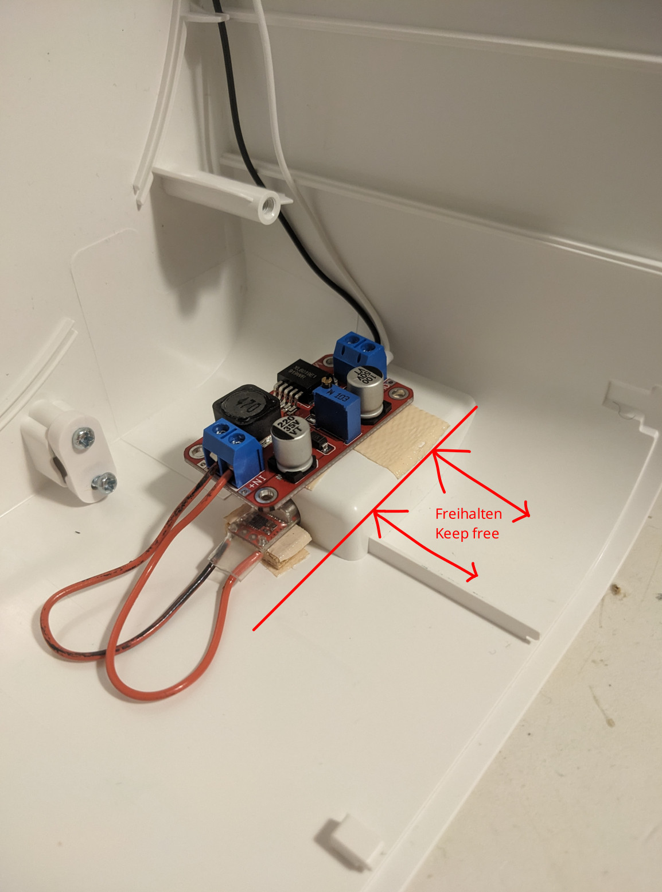

*English version below*

# Umbau vom IKEA Uppatvind auf USB-C

Der neue und kleine Luftfilter von IKEA für 35€ mit 95m³/h CADR. 

Günstig und funktional, aber leider mit einem Netzteil für 230V. Kann aber für ~ 10 € auf USB-C umgerüstet und somit per Powerbank genutzt werden.

Wenn du ein Lötkolben so halten kannst, dass es nicht nach Hähnchen riecht und ein Multimeter benutzen kannst, solltest du den Umbau auch bewerkstelligen können.

Umbau und Betrieb auf eigene Gefahr. Nach dem Umbau ist zwar alles Kleinspannung aber USB-C PD Netzteile können doch erhebliche Leistungen abgeben, sodass man bei Fehlern auch Magic Smoke, Schmoren oder Brand erzeugen kann.

# Anleitung

## Materialien 

* DC-BoostUp-Converter von 5V auf 24V mit min. 2A (besser 3A, lieber etwas überdimensionieren) Ausgangsstrom
* USB-C PD Trigger-Board (für z.B. 9V, ggf. optional, siehe unten zu weiteren Überlegungen zur Spannung)
* ein bisschen Kabel für zwischen Trigger-Board und BoostUp-Converter
* doppelseitiges Klebeband
* Heißkleber

Verwendeter BoostUp-Converter (no affiliate or something like that and there are better shops than Amazon): https://www.amazon.de/LAOMAO-Converter-Einstellbare-Ausgangsspannung-Netzteiladapter/dp/B0C2H6PFVH

## Werkzeug

* Schraubendreher
* Multimeter
* Seitenschneider (und ggf. Abisolierzange)
* Heißklebepistole

## Schritte

### Aufschrauben

Aus der Steckdose ziehen ;)

Vorfilter und Filter herausnehmen.

Mit einem passenden Schraubendreher die dreieckigen Schrauben herausschrauben.
Ein Schlitz-Schraubendreher mit ~ 4 mm Breite funktioniert auch, T8 könnte auch funktionieren.

Dann kann man den inneren Teil herausheben.
Hierbei vorsichtig mit dem Kabel zum Motor sein.
Das ist auf der Platine oben unter dem Knopf mit einem arretiertem Stecker befestigt.
Den abziehen, um entspannt arbeiten zu können.

### Originales Kabel entfernen

Die Zugentlastung unten vom originalen Kabel abschrauben. 

Das schwarz-weiße Kabel nah an der Außenisolierung durchschneiden und auf der Seite Richtung Platine abisolieren.

Den äußeren Teil vom Kabel herausziehen und weglegen.
Das ist genauso wie das Netzteil nun übrig.

### USB-C Trigger-Board und BoostUp einstellen

Bei einigen USB-C PD Trigger-Boards kann man die Ausgangsspannung einstellen, z.B. über Lötpäds.
Diese auf 9V Ausgangsspannung einstellen, siehe weiter unten für Überlegungen zur Spannung.

USB-C PD Netzteil anschließen, nachmessen, ob 9V herauskommen, Netzteil wieder herausziehen.

USB-C Trigger-Board mit dem Eingang vom BoostUp-Converter verbinden, so mit 5-10 cm Kabel. Polarität beachten.

USB-C Netzteil wieder rein, mit Multimeter den Ausgang vom Bootstyp-Konverter messen und mit dem Poti auf 24V Ausgangsspannung einstellen. Netzteil wieder herausziehen.

### Verkabeln

Das Kabel von der Platine an den BoostUp-Converter Ausgang anschließen. Die weiße Ader ist Plus und Schwarz ist Minus.

### Testlauf

Motorkabel wieder einschließen und alles so hinlegen, dass der Motor frei drehen kann. Dann Netzteil einstecken, anschalten und ausprobieren.

### Befestigen

Die USB-C Trigger-Boards passen meist unten in das Loch, wo vorher das Kabel rauskam. 

Mit einem doppelseitiges Klebeband, Sperrholz, doppelseitiges Klebeband Sandwich kann man das Trigger-Board da ganz gut befestigen und dann noch mit genug Heißkleber fixieren.

Den BoostUp-Converter auf diesen Buckel überm Loch mit doppelseitigem Klebeband kleben. Dabei beachten, dass der nicht über den Buckel nach Vorne überstehen darf, da dort das zweite Gehäuseteil aufliegt. 

Kabel gut verstauen.

### Zusammenbau

Wieder das Gehäuseteil mit dem Motor einsetzen. 

Dabei können sich die Kabel irgendwo dazwischen verfangen. Also gut schauen, dass alles am richtigen Platz sitzt und die Gehäuseteile plan und schlüssig ineinander liegen. 

Schrauben wieder reinschrauben, Filter wieder einsetzen und fertig :)

## Überlegungen zur Spannung

Der verwendete BoostUp-Converter hält die 24V Ausgangsspannung stabil bei Eingangsspannungen zwischen 5V und 20V.

Der Uppatvind zieht laut Anleitung maximal 19 Watt Leistung (24V, 0.8A). 

Leitungsabnahmen bei 5V Eingangsspannung am BoostUp-Converter Eingang gemessen:

* Einschalten von 0 auf Stufe 1, Spitze: 1A, 5W
* Stufe 1: 0.45A, 2.25W
* Stufe 2: 0.8A, 4W
* 2 auf 3 Spitze: 1.65A, 8.25W
* Stufe 3: 1.45A, 7.25W
* Einschalten von 0 direkt auf Stufe 3
    * Bei 5V kurzzeitig eindeutig mehr als 2A, da hat das Labornetzteil abgeregelt, die Spannung ist zusammengebrochen und Uppatvind hat das Einschalten abgebrochen.
    * Bei 9V waren es so 1A laut analoger Anzeige, also wahrscheinlich so 10 Watt oder so.

Die Spitzenströme sind von einer analogen Anzeige eines Labornetzteils abgelesen, ggf. werden kurzzeitig (kürzer als 1 sec) noch höhere Leistungen benötigt.

Man kann den Luftfilter also auch an einem leistungsfähigen 5V Netzteil/Powerbank (min. 2A) betreiben, man muss aber die Stufen nacheinander einschalten.
Somit kann auf das Trigger-Board ggf. auch verzichtet werden.
Das verwendete Trigger-Board gibt jedoch auch fröhlich 5V aus, wenn es die eingestellte Spannung nicht aushandeln kann, stört somit auch nicht.

Als Kompromiss scheint 9V als Ausgangsspannung vom USB-C PD Trigger-Board geeignet.
Die Spannung ist ausreichend hoch, sodass die Ströme nicht zu groß werden.
Außerdem wird von vielen (Handy-)Netzteilen 9V PD unterstützt.
15V oder 20V werden meist nur von Laptop USB-C Netzteilen unterstützt. 

Außerdem kann das verwendete Trigger-Board auch Qualcomm Quick Charge triggern und auch über diese Netzteile 9V beziehen.

Andere Spannungen könnten jedoch auch eine gute Wahl darstellen.

# Bild

# Conversion from IKEA Uppatvind to USB-C

*English translation partly by DeepL.*

The new and small air filter from IKEA for 35€ with 95m³/h CADR. 

Inexpensive and functional, but unfortunately with a power supply for 230V. But can be converted to USB-C for ~ 10 € and thus used with a power bank.

If you can hold a soldering iron so that it doesn't smell of chicken and can use a multimeter, you should be able to manage the conversion.

Conversion and operation at your own risk. After the conversion, although everything is low voltage, USB-C PD power supplies can still deliver considerable power, so that you can also generate magic smoke, smouldering or fire in the event of errors.

# Instructions

## Materials 

* DC-BoostUp-Converter from 5V to 24V with min. 2A (better 3A, preferably slightly oversized) output current
* USB-C PD trigger board (for e.g. 9V, maybe optional, see below for further voltage considerations)
* a bit of cable for between trigger board and BoostUp converter
* double-sided adhesive tape
* hot glue

BoostUp converter used (no affiliate or something like that and there are better stores than Amazon): https://www.amazon.de/LAOMAO-Converter-Einstellbare-Ausgangsspannung-Netzteiladapter/dp/B0C2H6PFVH

## Tool

* Screwdriver
* Multimeter
* Side cutter (and wire stripper if necessary)
* Hot glue gun

## Steps

### Unscrew

Pull the power adapter out of the socket ;)

Remove the pre-filter and filter.

Unscrew the triangular screws with a suitable screwdriver.
A slotted screwdriver with ~ 4 mm width also works, T8 could also work.

Then you can lift out the inner part.
Be careful with the cable to the motor.
This is attached to the circuit board at the top under the button with a locked plug.
Pull it off so that you can work in a relaxed manner.

### Remove the original cable

Unscrew the strain relief at the bottom of the original cable. 

Cut the black and white cable close to the outer insulation and strip the insulation on the side towards the circuit board.

Pull out the outer part of the cable and put it away.
Not needed anymore, just like the power adapter.

### Setting the USB-C trigger board and BoostUp

With some USB-C PD trigger boards, you can set the output voltage, e.g. via solder pads.
Set this to 9V output voltage, see below for voltage considerations.

Connect the USB-C PD power supply, check whether 9V is coming out, disconnect the power supply again.

Connect the USB-C trigger board to the input of the BoostUp converter with a 5-10 cm cable. Observe polarity.

Plug the USB-C power adapter back in, measure the output of the BoostUp converter with a multimeter and set the output voltage to 24V with the potentiometer. Pull out the power supply again.

### Wiring

Connect the cable from the circuit board to the BoostUp converter output. The white wire is positive and black is negative.

### Test run

Reconnect the motor cable and place everything so that the motor can rotate freely. Then plug in the power supply unit, switch the air filter on and try it out.

### Attach

The USB-C trigger boards usually fit into the hole at the bottom where the cable previously came out. 

With double-sided adhesive tape, plywood, double-sided adhesive tape sandwich you can attach the trigger board there quite well and then secure it with enough hot glue.

Glue the BoostUp converter to the hump above the hole using double-sided adhesive tape. Make sure that it does not protrude over the hump to the front, as the second housing part rests there. 

Stow the cable well.

### Assembly

Re-insert the housing section with the motor. 

The cables can get caught somewhere in between. So make sure that everything is in the right place and that the housing parts are flat and fit together properly. 

Screw the screws back in, reinsert the filter and you're done :)

## Voltage considerations

The BoostUp converter used keeps the 24V output voltage stable at input voltages between 5V and 20V.

According to the instructions, the Uppatvind draws a maximum of 19 watts of power (24V, 0.8A). 

Power consumption measured at 5V input voltage at the BoostUp converter input:

* Switching on from 0 to level 1, peak: 1A, 5W
* Level 1: 0.45A, 2.25W
* Level 2: 0.8A, 4W
* 2 to 3 peak: 1.65A, 8.25W
* Level 3: 1.45A, 7.25W
* Switching on from 0 directly to level 3
    * At 5V, it was clearly more than 2A for a short time, the laboratory power supply cut out, the voltage collapsed and Uppatvind stopped switching on.
    * At 9V it was 1A according to the analog display, so probably 10 watts or so.

The peak currents are read from an analog display of a laboratory power supply unit; even higher power may be required for a short time (less than 1 sec).

The air filter can also be operated with a powerful 5V power supply/power bank (min. 2A), but the fan levels must be switched on one after the other.
This means that the trigger board may not be necessary.
However, the trigger board used also happily outputs 5V if it can't negotiate the set voltage, so it does not interfere.

As a compromise, 9V seems suitable as an output voltage from the USB-C PD trigger board.
The voltage is sufficiently high so that the currents are not high.
In addition, many (cell phone) power supplies support 9V PD.
15V or 20V are usually only supported by laptop USB-C power supplies. 

In addition, the trigger board used can also trigger Qualcomm Quick Charge and also draw 9V via these power supplies.

However, other voltages could also be a good choice.

